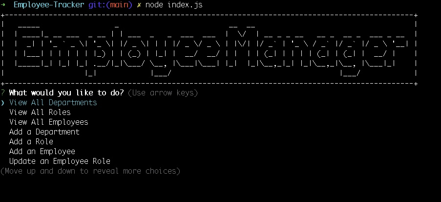

## Project Name
Employee-Tracker

## Version
1.0.0 Deployment Date: 2023-01-28 Contributors: Luis Llamas

## Description
The Note Taker is a Node.js command-line application that allows users to utilize the Note Taker application and be presented with a landing page with a link to a notes page.  When the user clicks on the link to the notes page, the user is shown a page with existing notes listed in the left-hand column, plus empty fields to enter a new note title and the note’s text in the right-hand column.  When the user enters a new note title and the note’s text, the "Save Note" button and a "Clear Form" button appear in the navigation at the top of the page.  When the user clicks on the Save button, the new note the user has entered is saved and appears in the left-hand column with the other existing notes, and the buttons in the navigation disappear.   When the user clicks on an existing note in the list in the left-hand column
THEN, that note appears in the right-hand column, and a "New Note" button appears in the navigation.  
When the user clicks on the "New Note" button in the navigation at the top of the page, the user is presented with empty fields to enter a new note title and the note’s text in the right-hand column, and the button disappears.

## Technologies & Prerequisites
The Employee Tracker application you're working on utilizes several key technologies and tools, each contributing to different aspects of the application's functionality. Here are the primary technologies used:

1. **Node.js**: A JavaScript runtime built on Chrome's V8 JavaScript engine. Node.js allows you to run JavaScript on the server side. It's the foundation of your application, enabling the use of JavaScript outside the browser.

2. **MySQL**: A popular open-source relational database management system. MySQL is used to store and manage the data for your application, including departments, roles, and employee information.

3. **MySQL2**: A Node.js package that provides an interface to interact with your MySQL database. It allows your application to run SQL queries, retrieve data, and perform CRUD (Create, Read, Update, Delete) operations on the database.

4. **Inquirer.js**: A Node.js package that provides a user-friendly interface for command-line input. It's used to create interactive prompts in the terminal, allowing users to input and select data in the application.

5. **dotenv**: A Node.js module that loads environment variables from a `.env` file into `process.env`. It's used to manage sensitive information, like database connection details, securely and separately from the codebase.

6. **Figlet**: A Node.js library for creating ASCII art from text. In your application, it's used to display stylized text in the command line interface for aesthetic purposes.

7. **console.table**: A package (or built-in console method in newer Node.js versions) that provides a simple way to display tabular data in the console. It's used to display the data retrieved from the MySQL database in a structured table format.

These technologies work together to create an interactive, command-line-based employee management system that can perform various operations related to managing departments, roles, and employees within a company.

## Installation Steps to run the Employee Tracker application
1. Clone the Repository:
2. Clone this repository to your local machine using Git.
3. git clone https://github.com/your-username/your-repository-name.git
4. Navigate to the Project Directory:
5. Install the necessary Node.js dependencies defined in the package.json file.
6. npm install, which will install all dependencies.
7. Set Up the Database:
8. Log in to your MySQL database using the MySQL command line or a tool like phpMyAdmin.
9. Create a new database for the application (e.g., employee_tracker).
10. Execute the SQL commands provided in the schema.sql file to create the necessary tables.
11. (Optional) Use the seeds.sql file to populate the database with initial data.
12. Configure Environment Variables:
13. Create a .env file in the root directory of the project.
14.  Add the following environment variables with your MySQL database credentials:
        DB_HOST=localhost
        DB_USER=your_mysql_username
        DB_PASS=your_mysql_password
        DB_NAME=employee_tracker
            **Replace your_mysql_username and your_mysql_password with your actual MySQL credentials from the 
            https://idp.bootcampspot.com/ Unit 12 submission portal.**  
15. Run the Application:
16. Start the application using Node.js.

## Testing
-At the prompt run: node index.js
-You should see the menu on the image shown below of the README.md

The following image shows the application's appearance:

## Video Demonstration
[Link to Walkthrough Video](#) - https://www.loom.com/share/3a02d4f9c6d24f819f3cf35af434248c?src=composer.

## GitHub project URL: https://github.com/maslla100/Employee-Tracker

